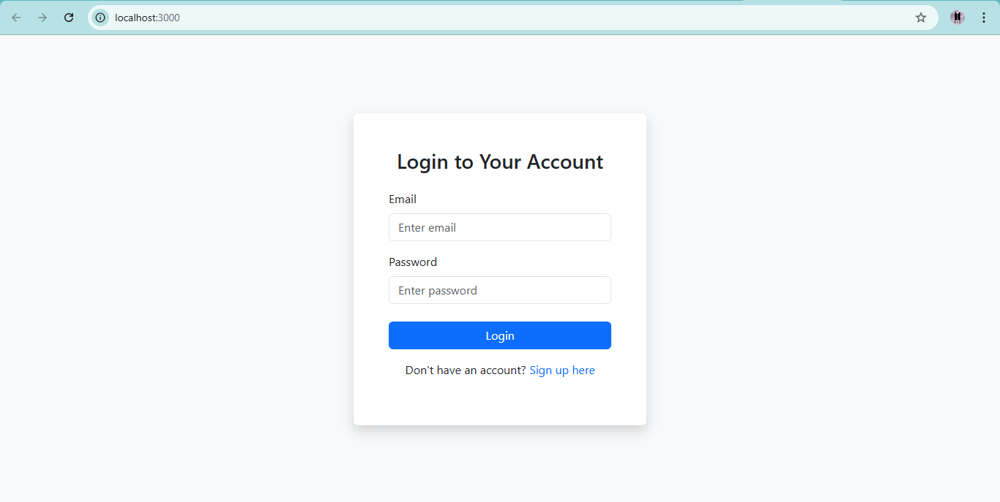
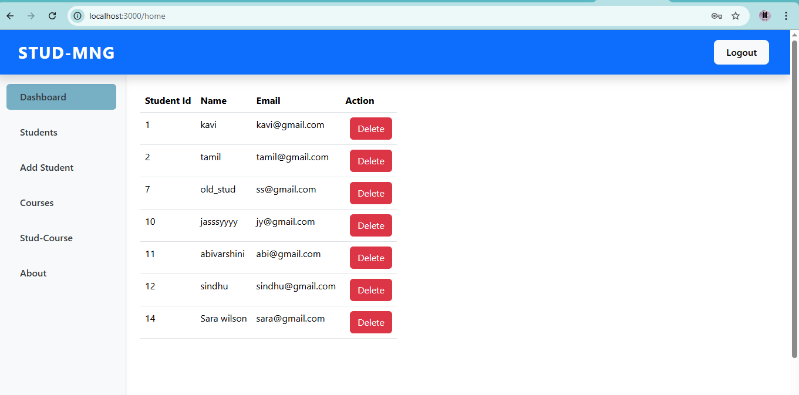
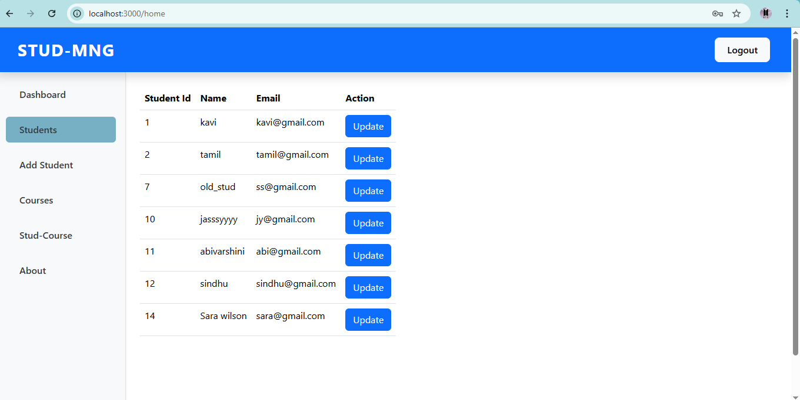
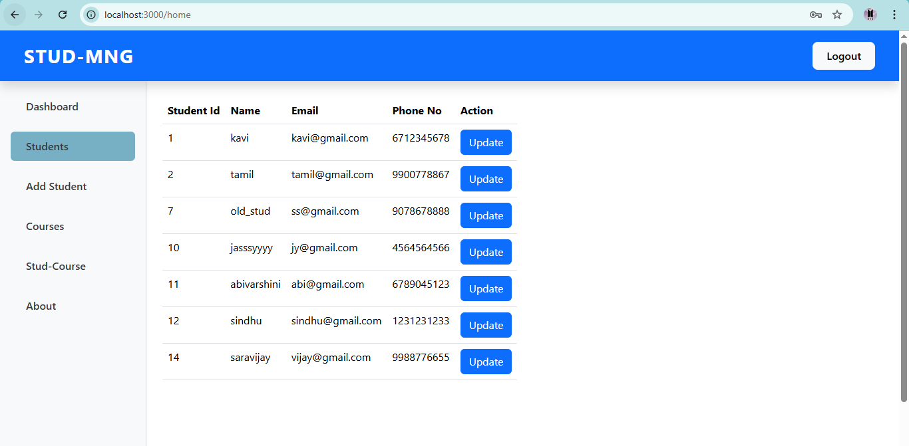
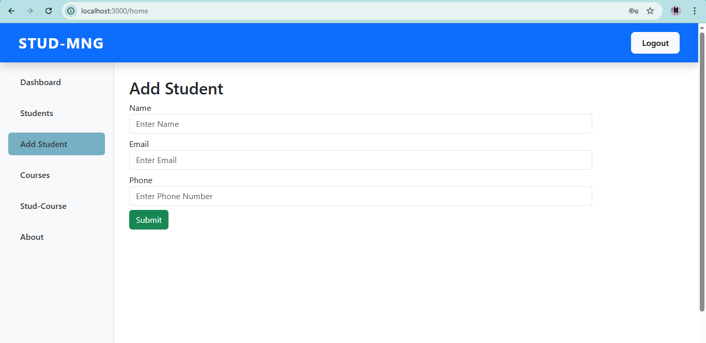
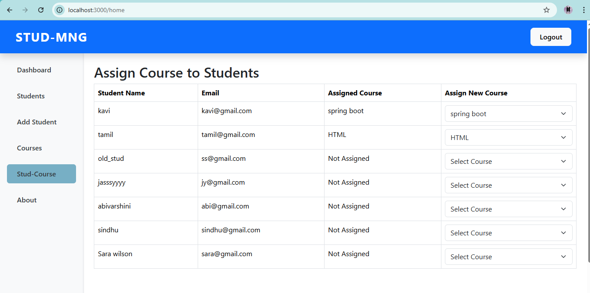
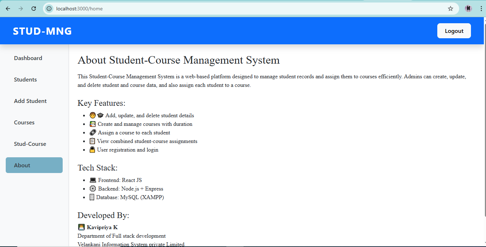
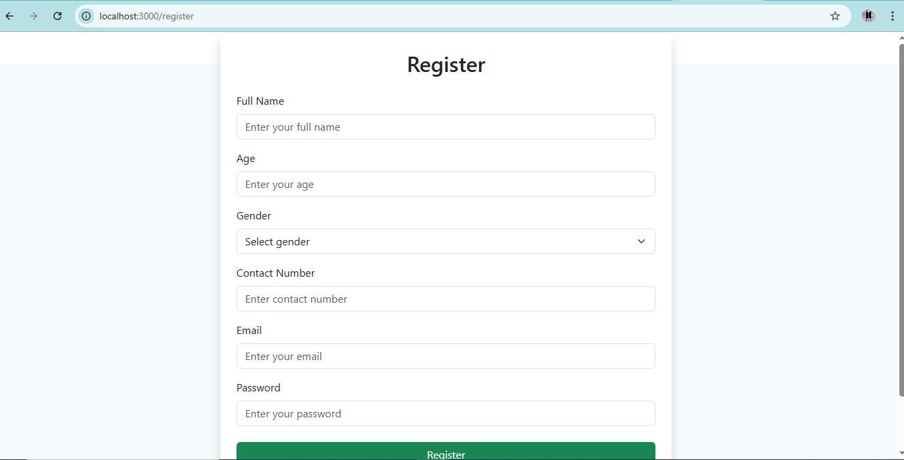

# Student-Course Management System

A full-stack Student-Course Management System that supports managing students, courses, and course assignments.  
Built with **React** (frontend), **Node.js + Express** (backend), and **MySQL** (database).

---

## ✨ Features

- 🧑‍🎓 View, add, update, and delete students
- 📚 Manage course details (name, instructor, duration)
- 🔗 Assign one course to each student
- 👨‍💼 Admin login and user registration
- 📋 Display assigned course with each student
- ✅ Responsive design using Bootstrap
- 📡 RESTful API with Express and MySQL

---

## 🛠 Technologies Used

- **Frontend**: React, Axios, Bootstrap
- **Backend**: Node.js, Express
- **Database**: MySQL (via XAMPP)
- **Other**: JWT Authentication, CORS, Git

---

## 🚀 How to Run the Application Locally

### 1️⃣ Prerequisites

- **Node.js** installed – [Download](https://nodejs.org/)
- **MySQL and XAMPP** installed – [Download](https://www.apachefriends.org/index.html)

---

### 2️⃣ Set Up the Database

1. Open **XAMPP**, start **Apache** and **MySQL**.
2. Go to [http://localhost/phpmyadmin](http://localhost/phpmyadmin).
3. Create a new database named: stud_crud

## Create the following tables:

➤ student Table

CREATE TABLE student (
  ID INT AUTO_INCREMENT PRIMARY KEY,
  Name VARCHAR(100),
  Email VARCHAR(100),
  phone VARCHAR(20),
  course_id INT,
  FOREIGN KEY (course_id) REFERENCES courses(ID)
    ON DELETE SET NULL
    ON UPDATE CASCADE
);

➤ courses Table

CREATE TABLE courses (
  ID INT AUTO_INCREMENT PRIMARY KEY,
  Name VARCHAR(100),
  Instructor VARCHAR(100),
  duration VARCHAR(100)
);

➤ user-list Table

CREATE TABLE `user-list` (
  ID INT AUTO_INCREMENT PRIMARY KEY,
  fullname VARCHAR(100),
  age INT,
  gender VARCHAR(10),
  contact VARCHAR(15),
  email VARCHAR(100),
  password VARCHAR(100)
);

## 3️⃣ Start the Backend Server

- cd backend
- npm install
- node index.js

## 4️⃣ Start the React Frontend

- cd ../frontend
- npm install
- npm start

---
## Screenshots
  
  

  
  
  
  

---
### Author
Kavipriya K

Email: kavipriyak920@gmail.com

GitHub: https://github.com/Kavipriya-123

---
