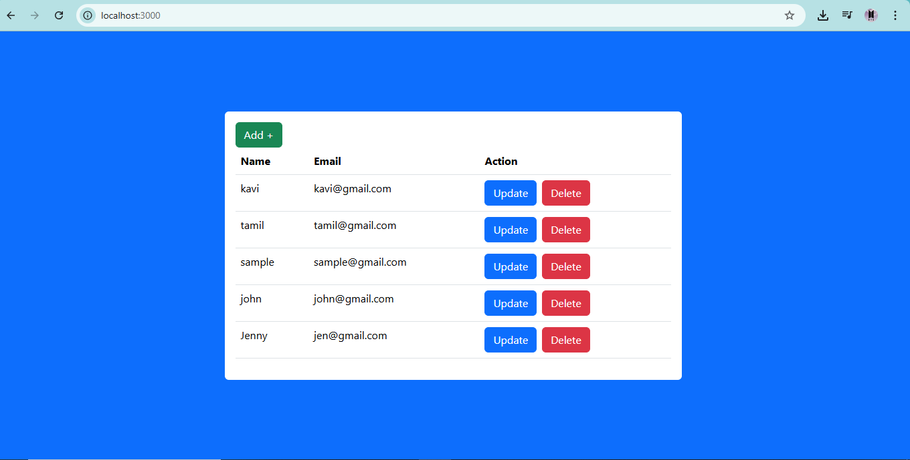
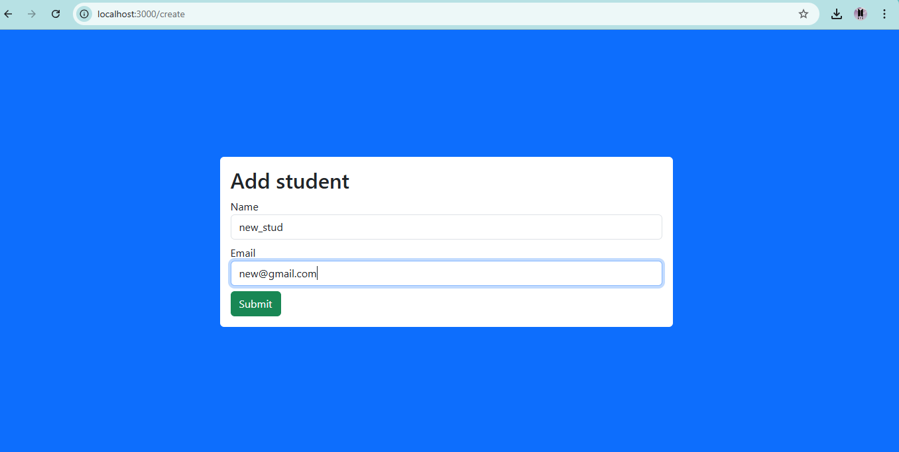
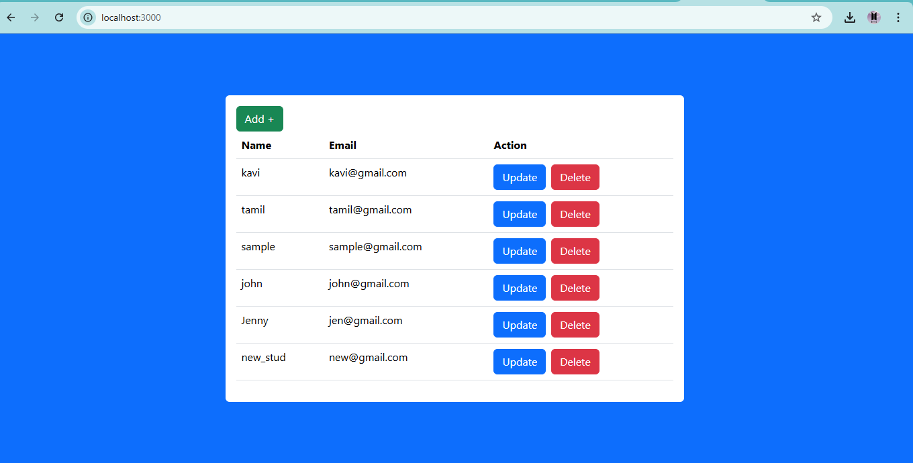
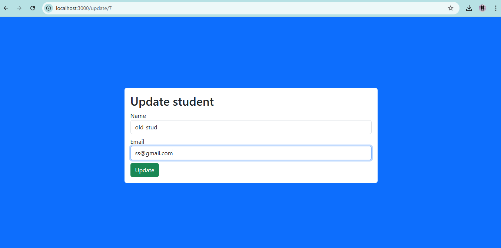
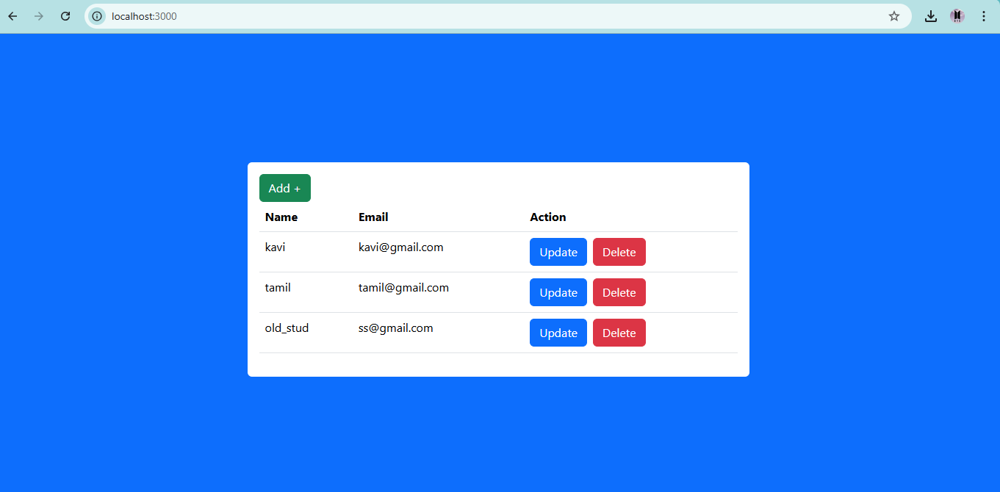

# Student Management System

A full-stack Student Management System application featuring CRUD (Create, Read, Update, Delete) operations.  
Built with **React** for the frontend, **Node.js** and **Express** for the backend API, and **MySQL** as the database.

---

## Features

- View all students on the home page
- Add new students with a dedicated form
- Update existing student details
- Delete students from the list
- Responsive UI built with Bootstrap
- RESTful API endpoints for seamless data management

---

## Technologies Used

- Frontend: React, React Router, Axios, Bootstrap
- Backend: Node.js, Express
- Database: MySQL
- Others: CORS middleware for API communication

---

## Folder Structure

- `frontend/` - React frontend application
- `backend/` - Node.js + Express backend API

---

## Getting Started

### Prerequisites

- Node.js installed ([download here](https://nodejs.org/))
- MySQL installed and running ([download here](https://dev.mysql.com/downloads/mysql/))
- Git installed (optional)

### Setup Instructions

#### 1. Clone the repository

git clone https://github.com/Kavipriya-123/student-management-system.git
cd student-management-system

#### 2. Backend Setup
- Navigate to the backend folder (if separated):
- cd backend
- Install dependencies:

- npm install express mysql cors
- Create a MySQL database:
- Start the backend server:
- node index.js
- The server will run on http://localhost:5000.

#### 3. Frontend Setup
- Navigate to the frontend folder:
- cd ../frontend
- Install dependencies:
- npm install react-router-dom axios bootstrap
- Start the React development server:
- npm start
- The app will be available at http://localhost:3000.

--- 
## Screenshots
  
  

  
  

---
### Author
Kavipriya K

Email: kavipriyak920@gmail.com

GitHub: https://github.com/Kavipriya-123

---