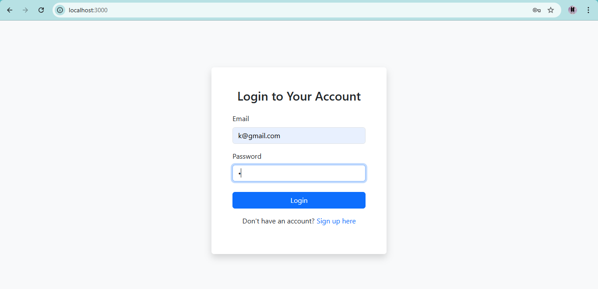
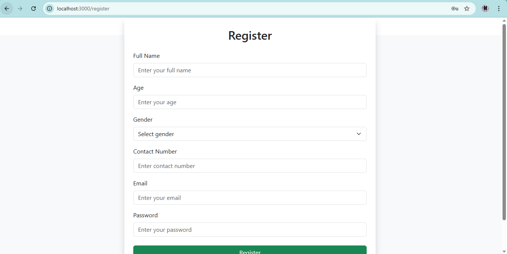
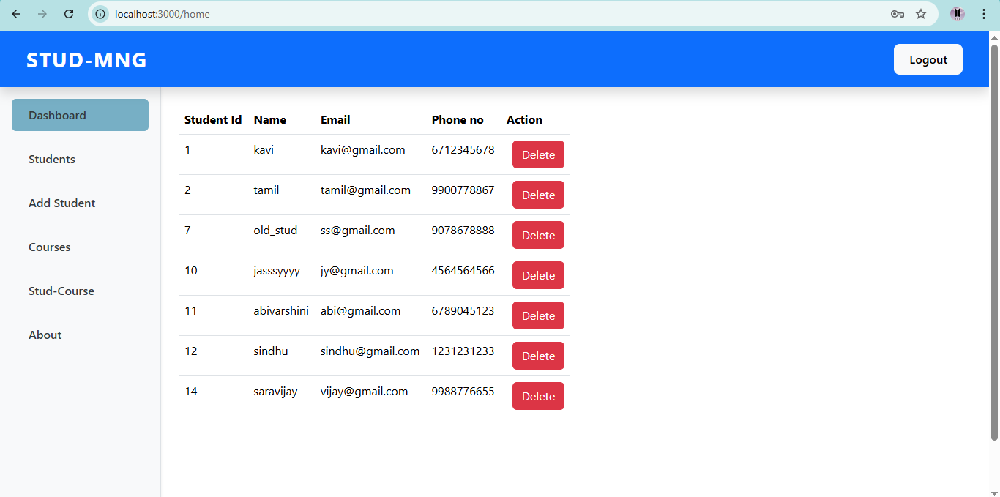
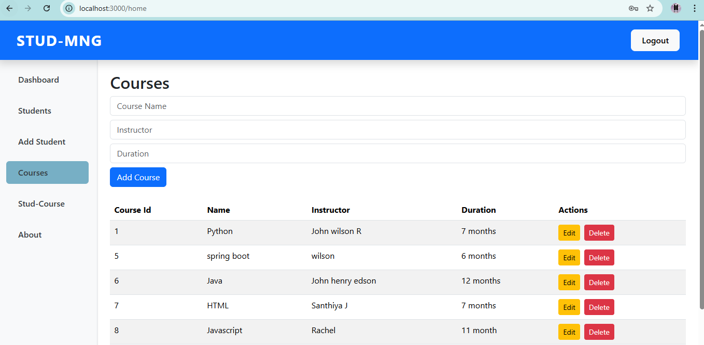
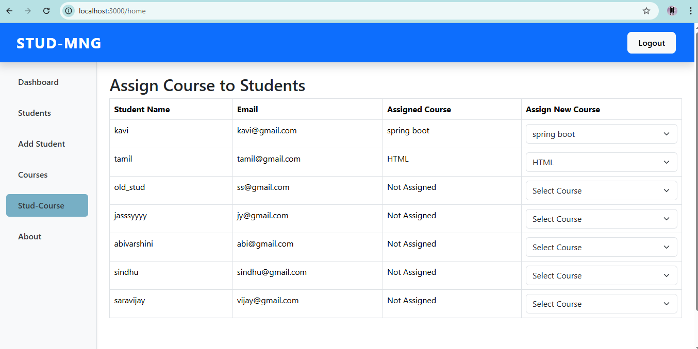

# Student-Course Management System

A full-stack Student-Course Management System that supports managing students, courses, and course assignments.  
Built with **React** (frontend), **Node.js + Express** (backend), and **MySQL** (database).

---

## ✨ Features

- 🧑‍🎓 View, add, update, and delete students
- 📚 Manage course details (name, instructor, duration)
- 🔗 Assign one course to each student
- 👨‍💼 Admin login and user registration
- 📋 Display assigned course with each student
- ✅ Responsive design using Bootstrap
- 📡 RESTful API with Express and MySQL

---

## 🛠 Technologies Used

- **Frontend**: React, Axios, Bootstrap
- **Backend**: Node.js, Express
- **Database**: MySQL (via XAMPP)
- **Other**: JWT Authentication, CORS, Git

---

## Screenshots
  
  

  
  
  
  

---
### Author
Kavipriya K

Email: kavipriyak920@gmail.com

GitHub: https://github.com/Kavipriya-123

---
